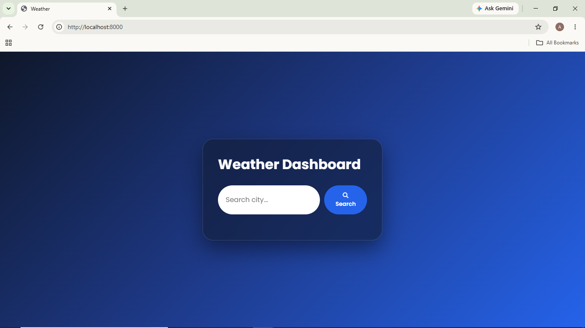
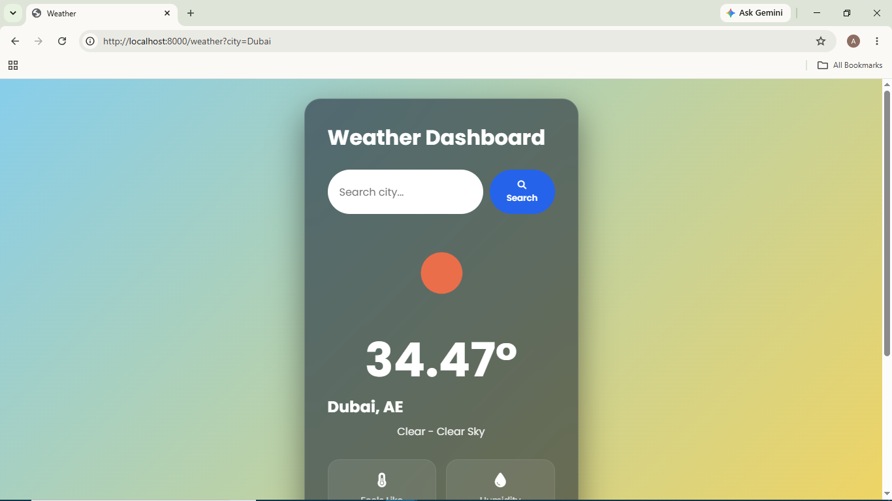
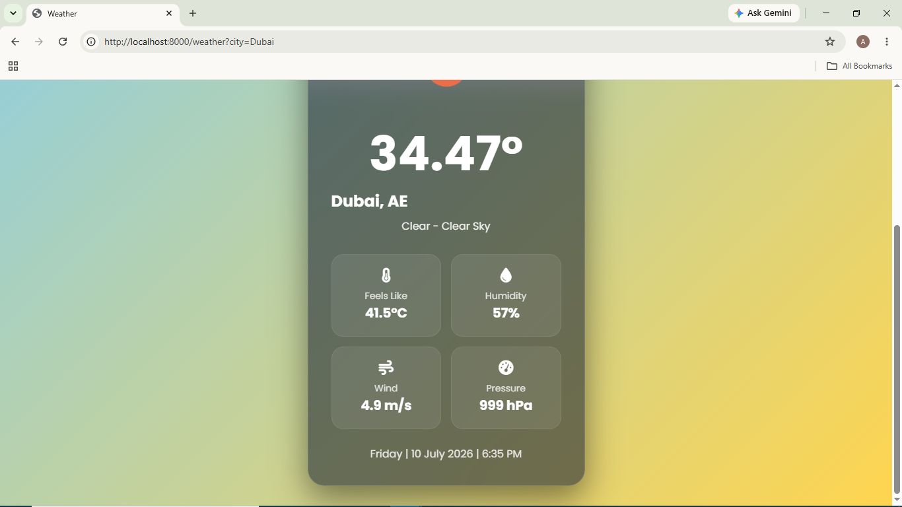
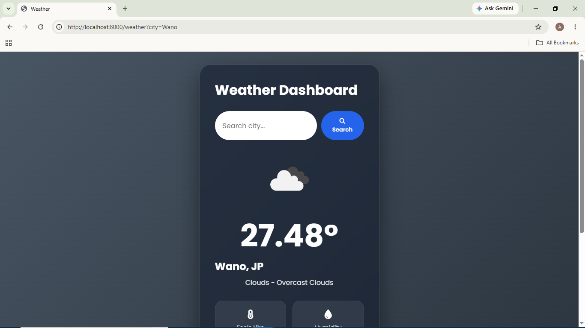
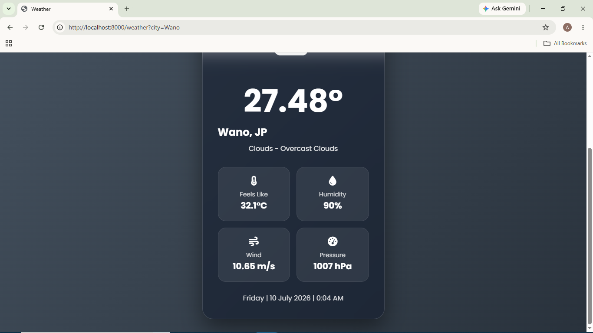
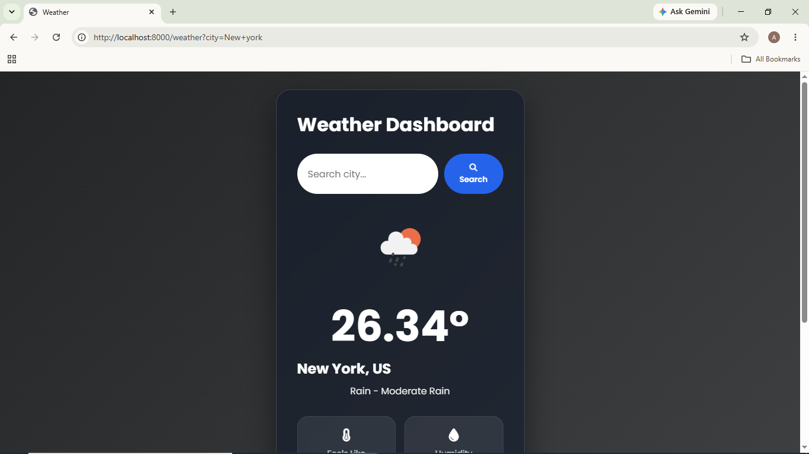
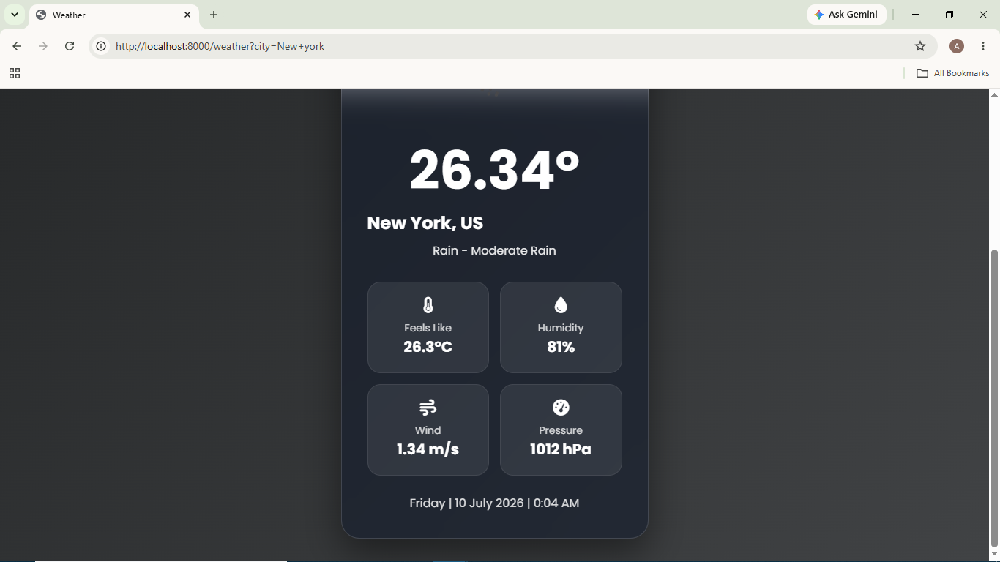
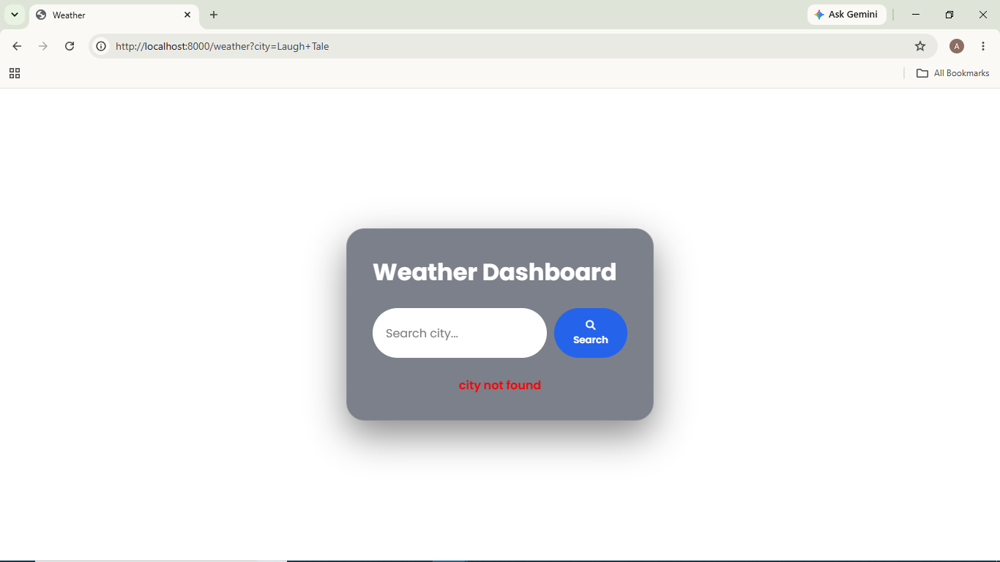

# 🌦️ Weather Identifier App using Node.js


A server-side rendered weather application built using **Node.js** and the native **HTTP module**. The application fetches real-time weather information from the **OpenWeather API** and dynamically generates HTML on the server using a lightweight template replacement approach without relying on Express or any templating engine.

---

## ✨ Features

- Search weather by city name
- Fetch real-time weather data from the OpenWeather API
- Server-side rendering (SSR)
- Dynamic HTML generation using placeholder replacement
- Basic routing using Node.js HTTP module
- Displays:
  - Current temperature
  - Feels-like temperature
  - Weather condition and description
  - Humidity
  - Wind speed
  - Atmospheric pressure
  - City and country
  - Current date and time
- Responsive UI for desktop and mobile devices
- Dynamic weather icons based on current conditions
- Weather-themed background that changes according to the current weather
- Handles invalid city names gracefully
- Lightweight implementation without external web frameworks

---

## 🛠️ Tech Stack

| Category | Technology |
|----------|------------|
| Runtime | Node.js |
| Language | JavaScript (ES6) |
| Backend | Native HTTP Module |
| Frontend | HTML5, CSS3 |
| External API | OpenWeather API |

---

## 📁 Project Structure

```text
WeatherIdentifierApp-Using-NodeJS/
├── index.js
├── home.html
├── styles.css
├── package.json
├── package-lock.json
├── .gitignore
└── README.md
```

---

## 🏗️ Application Flow

1. User enters a city name.
2. The browser sends a GET request to the Node.js server.
3. The server calls the OpenWeather API.
4. The JSON response is processed.
5. Placeholders in the HTML template are replaced with live weather data.
6. The completed HTML page is returned to the browser.

---

## 🧠 Concepts Demonstrated

- Creating HTTP servers with Node.js
- Server-side rendering (SSR)
- Basic request routing
- API integration using asynchronous JavaScript
- Dynamic HTML generation
- Processing JSON responses
- Error handling
- Building applications without Express
- Responsive frontend design
- Serving static assets using the Node.js HTTP module

---

## ⭐ Highlights

- Built using the native Node.js HTTP module (without Express)
- Server-side HTML rendering using custom placeholder replacement
- Real-time weather data from the OpenWeather API
- Responsive glassmorphism-based user interface
- Dynamic weather icons and backgrounds based on current conditions

---

## ⚙️ Getting Started

### Prerequisites

- Node.js (v14 or later)
- npm

Verify your installation:

```bash
node -v
npm -v
```

### Clone the Repository

```bash
git clone https://github.com/Atharva-Shelke/WeatherIdentifierApp-Using-NodeJS.git
```

### Install Dependencies

```bash
npm install
```

### Run the Application

```bash
node index.js
```

Open your browser and navigate to:

```text
http://localhost:8000
```

---

## 🔍 Usage

1. Launch the application.
2. Enter a city name in the search box.
3. Submit the request.
4. View detailed real-time weather information including temperature, feels-like temperature, humidity, wind speed, pressure, and weather conditions.

> **Note:** The API key is stored in the application for demonstration purposes. In a production application, it should be secured using environment variables or a backend configuration.

---

## 📸 Screenshots

### Home Page



### Weather Result(Sunny)




### Weather Result(Cloudy)




### Weather Result(Rainy)




### Invalid City



---

## 📚 What I Learned

- Building HTTP servers with Node.js
- Building responsive user interfaces with HTML and CSS
- Designing server-rendered applications without frontend frameworks
- Integrating external APIs into Node.js applications
- Routing using the native HTTP module
- Processing asynchronous API responses
- Error handling in Node.js applications
